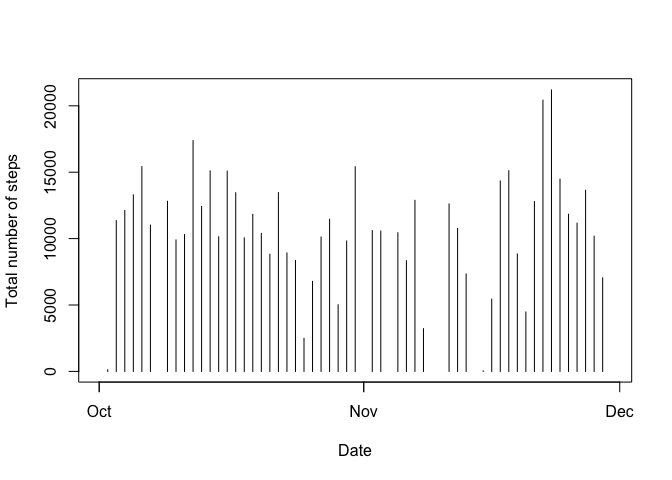
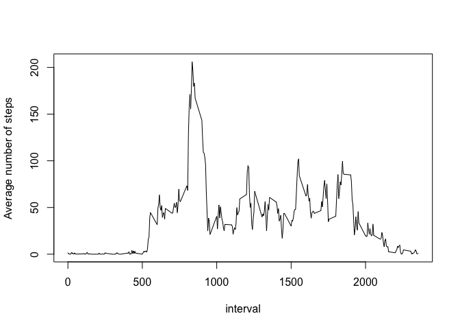
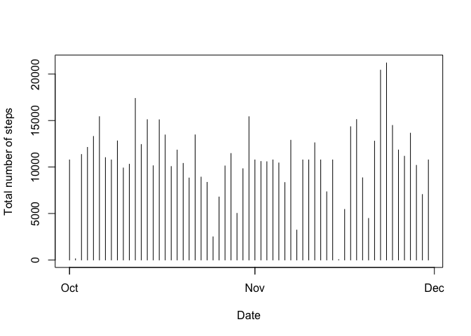
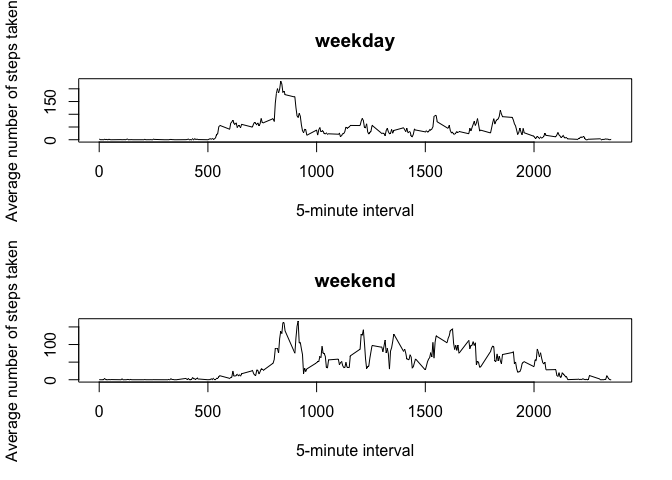

# Reproducible Research: Peer Assessment 1


## Loading and preprocessing the data
1. Load the data

```r
unzip("activity.zip")
dat1<-read.csv("./activity.csv")
```
2. Check the raw data and process the raw data

```r
head(dat1)
```

```
##   steps       date interval
## 1    NA 2012-10-01        0
## 2    NA 2012-10-01        5
## 3    NA 2012-10-01       10
## 4    NA 2012-10-01       15
## 5    NA 2012-10-01       20
## 6    NA 2012-10-01       25
```

```r
str(dat1)
```

```
## 'data.frame':	17568 obs. of  3 variables:
##  $ steps   : int  NA NA NA NA NA NA NA NA NA NA ...
##  $ date    : Factor w/ 61 levels "2012-10-01","2012-10-02",..: 1 1 1 1 1 1 1 1 1 1 ...
##  $ interval: int  0 5 10 15 20 25 30 35 40 45 ...
```

```r
library(lubridate)
library(dplyr)
```

```
## 
## Attaching package: 'dplyr'
## 
## The following objects are masked from 'package:lubridate':
## 
##     intersect, setdiff, union
## 
## The following object is masked from 'package:stats':
## 
##     filter
## 
## The following objects are masked from 'package:base':
## 
##     intersect, setdiff, setequal, union
```

```r
dat1<-mutate(dat1,Date=ymd(date))
```

## What is mean total number of steps taken per day?
1. Make a histogram of the total number of steps taken each day

```r
dat2<-split(dat1,dat1$date)
y1<-sapply(dat2,function(x) sum(x$steps,na.rm=T))
y1[y1==0]<- NA
x1<-unique(dat1$Date)
h1<-data.frame(x1,y1)
plot(h1,type="h",xlab='Date',ylab='Total number of steps')
```

 
2. Mean and median total number of steps taken per day

```r
m1<-mean(y1,na.rm=T)
mean(y1,na.rm=T)
```

```
## [1] 10766.19
```

```r
m2<-median(y1,na.rm=T)
median(y1,na.rm=T)
```

```
## [1] 10765
```
* The mean value of total number of steps taken per day is 1.0766189\times 10^{4}
* The median value of total number of steps taken per day is 10765


## What is the average daily activity pattern?

1. Time series plot of the 5-minute interval and the average number of steps taken, averaged across all days

```r
dat3<- split(dat1,dat1$interval)
y2<- sapply(dat3,function(x) mean(x$steps,na.rm=T))
x2<-unique(dat1$interval)
h2<-data.frame(x2,y2)
plot(h2,type="l",xlab='interval',ylab='Average number of steps')
```

 

2. The interval contains the maximum number of steps

```r
n1<-which.max(h2$y2)
n2<-h2$x2[n1]
h2$x2[n1]
```

```
## [1] 835
```
The interval contains the maximum number of steps is 835


## Imputing missing values

1. Total number of rows with NAs

```r
nna<-sum(is.na(dat1$steps))
sum(is.na(dat1$steps))
```

```
## [1] 2304
```

The total number of rows with NAs is 2304

2. Filling in the missing values in the dataset. In order to fill in the missing values in the dataset, here, the mean for that 5-minute interval is used to replace the individual missing values

3. Here is the code for creating a new dataset


```r
datall1<-merge(dat1,h2,by.x="interval",by.y="x2")
datall1$steps[is.na(datall1$steps)]<- datall1$y2[is.na(datall1$steps)]
```
We can check the new data set

```r
summary(datall1)
```

```
##     interval          steps                date            Date           
##  Min.   :   0.0   Min.   :  0.00   2012-10-01:  288   Min.   :2012-10-01  
##  1st Qu.: 588.8   1st Qu.:  0.00   2012-10-02:  288   1st Qu.:2012-10-16  
##  Median :1177.5   Median :  0.00   2012-10-03:  288   Median :2012-10-31  
##  Mean   :1177.5   Mean   : 37.38   2012-10-04:  288   Mean   :2012-10-31  
##  3rd Qu.:1766.2   3rd Qu.: 27.00   2012-10-05:  288   3rd Qu.:2012-11-15  
##  Max.   :2355.0   Max.   :806.00   2012-10-06:  288   Max.   :2012-11-30  
##                                    (Other)   :15840                       
##        y2         
##  Min.   :  0.000  
##  1st Qu.:  2.486  
##  Median : 34.113  
##  Mean   : 37.383  
##  3rd Qu.: 52.835  
##  Max.   :206.170  
## 
```
As summary, there is no missing values in the new data set

4. Make a histogram of the total number of steps taken each day and Calculate and report the mean and median total number of steps taken per day.


```r
dat4<-split(datall1,datall1$date)
y4<-sapply(dat4,function(x) sum(x$steps,na.rm=T))
h4<-data.frame(x1,y4)
plot(h4,type="h",xlab='Date',ylab='Total number of steps')
```

 

```r
newm1<-mean(y4,na.rm=T)
mean(y4,na.rm=T)
```

```
## [1] 10766.19
```

```r
newm2<-median(y4,na.rm=T)
median(y4,na.rm=T)
```

```
## [1] 10766.19
```

```r
newm2- m2
```

```
## [1] 1.188679
```

* The mean value of total number of steps taken per day for new filled data is 1.0766189\times 10^{4}
* The median value of total number of steps taken per day for new filled data is 1.0766189\times 10^{4}
* Therefore, compared with the calculation from part1, the mean value doesn't change, while the median value has a difference of 1.188679, which is quite small. So the impact of the imputing missing data is small.

## Are there differences in activity patterns between weekdays and weekends?

1. Differences in activity patterns between weekdays and weekends


```r
datall2<- mutate(datall1,weeklevel=weekdays(Date,T))
weekday<-datall2$weeklevel == "Mon" | datall2$weeklevel == "Tue" | datall2$weeklevel == "Wed" | datall2$weeklevel == "Thu" | datall2$weeklevel == "Fri"
weekend<-datall2$weeklevel == "Sat" | datall2$weeklevel == "Sun"
datall2$weeklevel[weekday]<- c("weekday")
datall2$weeklevel[weekend]<- c("weekend")
head(datall2)
```

```
##   interval    steps       date       Date       y2 weeklevel
## 1        0 1.716981 2012-10-01 2012-10-01 1.716981   weekday
## 2        0 0.000000 2012-11-23 2012-11-23 1.716981   weekday
## 3        0 0.000000 2012-10-28 2012-10-28 1.716981   weekend
## 4        0 0.000000 2012-11-06 2012-11-06 1.716981   weekday
## 5        0 0.000000 2012-11-24 2012-11-24 1.716981   weekend
## 6        0 0.000000 2012-11-15 2012-11-15 1.716981   weekday
```
This shows the first 6 lines of the data with new factor variable with two levels -  weekday and weekend indicating whether a given date is a weekday or weekend day

2. Make a panel plot containing a time series plot of the 5-minute interval and the average number of steps taken, averaged across all weekday days or weekend days


```r
wday<-subset(datall2,weeklevel=="weekday")
wend<-subset(datall2,weeklevel=="weekend")
w1<- split(wday,wday$interval)
wy1<-sapply(w1,function(x) mean(x$steps,na.rm=T))
wh1<-data.frame(x2,wy1)
w2<- split(wend,wend$interval)
wy2<-sapply(w2,function(x) mean(x$steps,na.rm=T))
wh2<-data.frame(x2,wy2)
par(mfrow=c(2,1))
plot(wh1,type="l",xlab="5-minute interval",ylab="Average number of steps taken",main="weekday")
plot(wh2,type="l",xlab="5-minute interval",ylab="Average number of steps taken",main="weekend")
```

 

